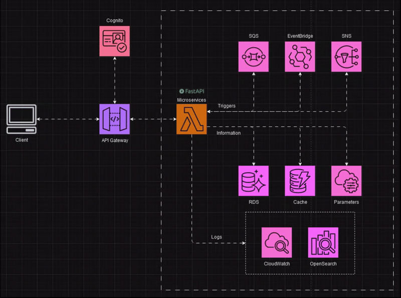
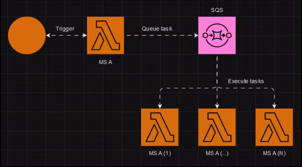

<p style="text-align: center;">
  <a href="https://fastapi.tiangolo.com"></a>
</p>
<p style="text-align: center;">
    <em>Production ready Python Microservice for AWS Lambda on <a href="https://fastapi.tiangolo.com">FastAPI</a></em>
</p>

---

**Documentation**: <a href="https://fastapi.tiangolo.com" target="_blank">https://fastapi.tiangolo.com</a>

**Source Code**: <a href="https://github.com/tiangolo/fastapi" target="_blank">https://github.com/tiangolo/fastapi</a>

---

## Installation
Requirements installation

**Pre-commit hooks installation:**
```bash
$ pip install pre-commit==3.5.0
$ pre-commit install
```

### Linting
```bash
$ pre-commit run --all-files
```

## Running

Running the app using Docker is recommended, it will automatically install all the dependencies, database and run the app.
Otherwise, you can run the app using VENV, but you will need to install the dependencies and database manually.

**_Note:_** Environment variables required for the app to run are located in the `.env.sample` file. Modify the file name to `.env` and fill in the values.

**Using Docker**
```shell
$ docker-compose build
$ docker-compose up app
```

_OR_

**Using VENV**
```bash
$ pip install -r requirements.txt -r app/requirements.txt
$ cd app
$ uvicorn main:app --reload
```

Then open the browser at the address: http://localhost:8000/docs

---

## Migrations

**Using Docker**

```bash
$ docker-compose build
$ docker-compose run migrations
```

_OR_

**Using VENV**
```bash 
$ alembic upgrade head
```

---

## Testing

### Using Docker
```bash
$ docker-compose build
$ docker-compose run tests
```

_OR_

###  Using VENV
```bash
$ pip install -r tests/requirements.txt
$ pytest tests -c pytest-conf.ini
```

---

## Architecture

<p style="text-align: center;"></p>

### SQS Trigger example
<p style="text-align: center;"></p>
